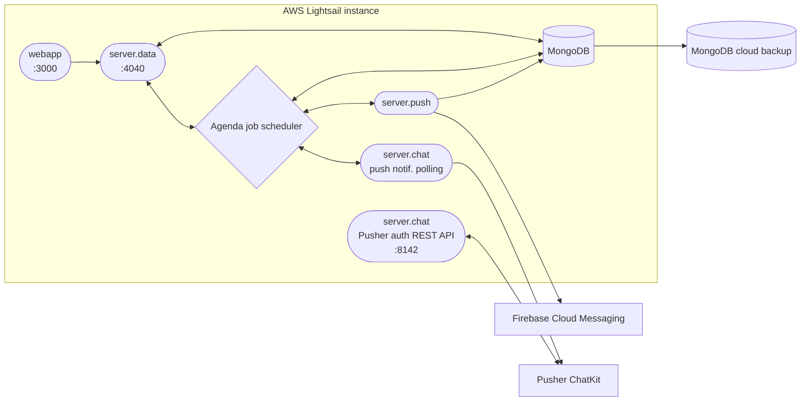

### Ciao, mi chiamo Gianfranco 👋

> Tinkerer ✦ Software Developer ✦ Dog father 🐶

- ☀️ I'm living in sunny Madrid, Spain 🌞
- Tech Stack: `Next.js | TypeScript | React | Python | Node.js | PostgreSQL | MongoDB | AWS | Vercel | Generative AI (text and audio) | Agentic systems`
- Blog:
  - <https://gian.cool>
- Socials:
  <!-- -  [YouTube](https://www.youtube.com/@gianpaj) -->
  -  [Twitter/X](https://x.com/gianpaj)
  -  [LinkedIn](https://linkedin.com/in/gianpaj)
  -  [Goodreads](https://www.goodreads.com/user/show/10470860-gianfranco)
- ⚡ Fun fact:
  - My first computer was a Compaq Presario in 1995 in Ecuador – I was 8 years old. It came with Windows 3.1, but you could install Windows '95. I was amazed by the possibilities of computers and the internet (dial-up). I still cherish those memories 🕹️😊

## Businesses

- ☎️ [HolaBrisa](https://holabrisa.com) - a thoughtful text and voice AI receptionist that gives every hotel guest an immediate, personal welcome.
- 🎙️ [SexyVoice.ai](https://sexyvoice.ai) ([repo](https://github.com/gianpaj/sexyvoice)) - Text to Speech and Voice cloning platform. Perfect for content creators, developers, and storytellers

## Onova 🇺🇦

[Onova.co](https://www.onova.co/) was a mobile marketplace for second-hand and sustainable clothing, "Instagram with a buy button". [Alex](https://github.com/krokubik) and I first built Givebox, an app for giving things away in your local area, working remotely from Ireland and Poland. Clothing turned out to be the largest category, so we moved to Lviv, Ukraine, and went full-time on Onova. The company ran until September 2019.

Young people in Ukraine bought clothes in thrift stores and resold them on social media, a market full of scammers, with no payments, reviews or search. On Onova, buyers followed shops to build a personal feed. Sellers announced a *drop*, a batch of items going on sale at a set date and time. Buyers subscribed, got a notification when it opened and competed to buy. Payments went through UAPay and were held in escrow until the buyer collected the package from Nova Poshta, and Onova took a small fee from each completed order. [Drop](https://github.com/gianpaj/onova-webapp-drop) was a spin-off app built from the same codebase.

I wrote almost all of the code: about 4,500 commits between 2017 and 2020. The [iOS and Android apps](https://github.com/gianpaj/onova-mobileapp) were one React Native codebase that built both Onova and Drop. The web apps used React and TypeScript. A set of small Node.js services ran on a single AWS Lightsail instance under pm2 and shared one MongoDB database:

- [`server.data`](https://github.com/gianpaj/onova-server.data): the Express REST API behind the apps and web apps, covering the order flow, feed, search and drops, with about 400 tests
- [`server.push`](https://github.com/gianpaj/onova-server.push): push notifications through Firebase Cloud Messaging
- [`server.chat`](https://github.com/gianpaj/onova-server.chat): order updates posted into buyer–seller chats on Pusher ChatKit, later Sendbird
- Agenda: a MongoDB-backed job scheduler for order deadlines and notifications
- [Forest Admin](https://github.com/gianpaj/onova-forest-admin): the back office
- An Instagram importer: sellers linked their account, and a [Google AutoML image classifier](https://github.com/gianpaj/onova-automl-server) picked out posts showing items for sale and turned them into listings on their Onova shop

Details

 

## Side projects 👨‍💻

- 🔥 [Walnut.tv](https://walnut.tv) ([repo](https://github.com/gianpaj/walnut.tv)) - Discover trending videos from Reddit and curated YouTube channels
- 📞 [agentcaller.io](https://agentcaller.io) ([repo](https://github.com/gianpaj/agentcaller-io)) - AgentCaller.io lets your AI agent (e.g. OpenClaw) call businesses — booking a restaurant, etc.
- 🎯 [3dvibegame.com](https://3dvibegame.com) ([repo](https://github.com/gianpaj/3dvibegame)) - 3d multiplayer game where you can create any 3d object, move around and manipulate objects with text. My first game
- ⚽️ [football_analysis_yolo](https://github.com/gianpaj/football_analysis_yolo) - A Machine Learning project using YOLO and OpenCV to automate soccer match analysis, player tracking, and performance insights from live or pre-recorded video footage.

<!-- - 🤖 [Call Me Now Please app](https://github.com/gianpaj/call-me-please) - A mobile application that lets users schedule AI-powered voice calls. -->
<!-- - [CoverLetter.work](https://coverletter.work) - Get a tailored cover letter in seconds, for FREE! 🤖 -->

<!-- - **CoMaking Malaga** - An upcoming Hackerspace / Makerspace for meeting new people and making cool stuff. -->
